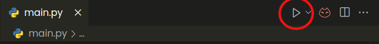

# [**_Car Shopping_**](https://github.com/PacomeKFP/python_car_shop)

>##  **Description**
>
>Il s'agit d'un projet de classe visant à la réalisation d'une boutique virtuelle en Python.
>
>Elle vise à la réalisation d'un systeme générant des factures pour chaque achat fait par de potentiels clients, et accordant des réductions de prix aux clients reguliers,ceux qui acheterons plus de deux fois le meme article.

>## **Installation**
>Dans l'optique de pousser l'apprentissage et aussi de rendre le programme plus interactif et les factures generées élégantes, nous avons fait usage de modules python tels que:
>-  [**tkinter**](https://docs.python.org/fr/3/library/tk.html): Afin de générer des interfaces graphiques de l'application, nous avons utilisé [_tkinter_](https://docs.python.org/fr/3/library/tk.html)  qui est un bibliothèque d'interface graphique assez simple et pratique pour le projets de faible envergure.
>- [**tabulate**](https://pypi.org/project/tabulate/): Ce module quant à lui permet de representer de façon assez élégante les éléments des structures de données de type itérable comme les `listes`, les `dictionnaires` ou les `tuples`, sous forme de tableau avec des séparateurs élégants.
>-  [**json**](https://docs.python.org/fr/3/library/json.html): pour l'enregistrement des données d'applications à la fermeture; Ce même module nous permettra donc de garder en memoire physique (`ROM`) les données d'applications comme: les noms des differents clients ayant fait des achats, leurs achats à chacune de ces occasions ainsi que les differents articles de la boutique et leur nombre en stock, mais aussi les traces des différentes factures generées; Pour une meilleure exploitation des ces données, elles sont stockées sous forme de dictionnaires dans des fichiers d'extentions _.json_. Ce module aidera donc à la gestion des données de l'application.
>
> Afin d'installer correctement les différents modules inclus dans un projet python, il est mis à notre disposition un installateur de package appelé [**`pip`**](https://docs.python.org/fr/3/installing/index.html), et un prinicipe de description des utilitaires pour le projet. Il s'agit d'écrire dans un fichier préréquis pour installer le projet. Dans notre cas, ces necessités ont été spécifiées dans le fichier _requirements.txt_ et pour installer ces préréquis, il suffit de connecter son ordinateur à internet puis taper la commande  
>>_**`pip install -r requirements.txt`**_

># Execution
>Après avoir installé correctement les différentes bibliothèques réquises, il est possible de lancer le programme principale (_fichier `main.py`_) en utilisant la commande `python main.py` (ayant bien configuré le chemin d'accès au programme python dans les variables d'environnement d'utilisateur). Il est également possi ble d'executer le programme en se servant d'un IDE tel que [_Pycharm_](https://www.jetbrains.com/pycharm/download/) ou encore [_Visual Studio Code_]() (il faudra installer l'extension python sur ce dernier pour qu'il puisse débugger correctement du code python), avec un IDE comme l'un il suffira de cliquer sur le triangle en haut à droite:
>
>
>
>Une fois ouvert le programme vous demange d'entrer votre nom: le nom du client,une fois confirmé, s'ouvre une interface qui vous presentera les articles de la boutiques ainsi que votre panier qui est initialement vide.Vous le remplirer en cliquant sur les différents articles de la boutique, et vous le retirerez en cliquant sur les articles dans votre panier, ils retoureneront automatiquement dans la boutique.
Vous achats terminés, vous pouvez valider votre commande et votre facture sera générée. Toutefois il est possible pour un client d'obtenir une réduction sur des produits, pour cela, il doit acheter au moins deux fois différentes un même article; au troisième achat, il obtiendra alors une réductions sur le prix de l'article. 

>#  Structuration du code
>   le dossier contient une partie code et une partie donnée:
> **La partie code**: elle est constituée de plusieurs fichiers en l'occurence:
>-  le fichier `main.py`: contient le code principal de l'appliation: l'exécution des fonctions principales, la navigation entre les interfaces ainsi que la sauvegarde des informations.
>
>- Le fichier `functions.py`: contient les différentes fonctions du programmes, celles liées à la gestion du panier. Aucune de ces fonctions ne modifie directement l'inferface graphique, elles effectuent uniquement des modifications sur les données courantes de l'application.
>
>- Le fichier `my_frames.py`: contient les différentes fonctions du programme liées aux interfaces graphiques. On y retrouve les différents tableaux qui servent soit de panier pour l'utilisateur soit de liste d'articles disponibles dans le magasin. Ces fonctions font appel à l'outil *TreeView* de Tkinter
>
>- Le fichier `constants.py` qui contient les différentes constantes utilisées dans l'application à l'instar du nom de la boutique ainsi que les différentes couleurs et polices utilisées pour les interfaces graphiques. 
>
>- Le fichier `requirements.txt` qui contient les modules necessaires à l'installation du programme.
>
>**La partie Donnée**: consituée du dossier `data`, ce  dernier contient:
>-  les fichiers `clients.json`, `articles.json` et `invoices.json`. Ces derniers representent les données d'application, en l'occurence la liste des clients ayant fait des achats dans l'application; Les différents articles en stock dans la boutique. Les différentes factures générées (les données de ces factures: nom du client, différents articles achetés, nom du fichier de facture ...).
>-  le dossier `doc`: qui contient les images necessaires à la redaction de cette documentation
>-  le dossier `bills`: qui contient les différentes factures generées par l'applications. Ces factures sont rangées dans des dossiers chaque dossier portant le nom du client auquel il se rapporte.

>#  Deploiement:
>Afin de rendre le projet accessible à grand monde, ce programme sera deployé et hebergé sur le [depot github *python_car_shop*](https://github.com/PacomeKFP/python_car_shop.git) du profil [PacomeKFP](https://github.com/PacomeKFP?tab=repositories). Pour tout désir de contribution, remarque ou besoin de contact, mon email est laissé plus bas: 

>###   Ecris par les étudiants du **niveau 2** du groupe **B de [l'Ecole Nationale Superieure Polytechnique de Yaoundé](https://polytechnique.cm/)** :
>- [`Kengali Fegue Pacome`](mailto:pacomekengafe@gmail.com): 
>- `Ngoupaye Ivan` 
>- `Ndong Fils` 
